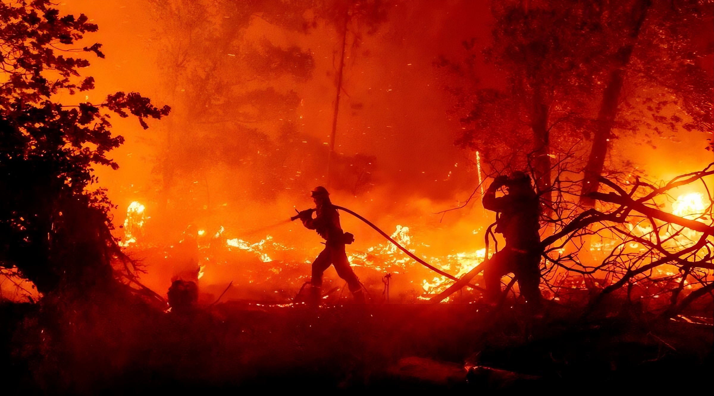
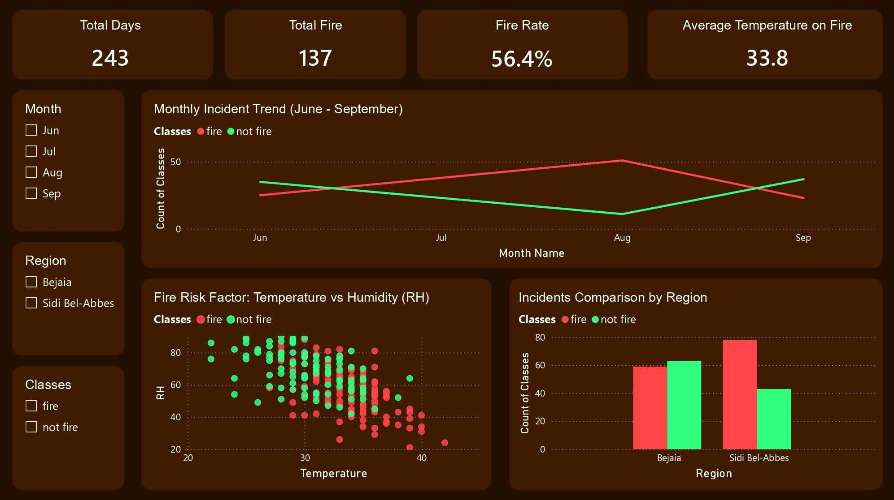

# Algerian Forest Fires Analysis & Risk Factors

Saya menganalisis data dari Kaggle yaitu data kejadian kebakaran hutan di dua wilayah di Aljazair (Algerian Forest Fires) pada tahun 2012. (https://www.kaggle.com/datasets/nitinchoudhary012/algerian-forest-fires-dataset)  

Aljazair merupakan negara terbesar di Afrika yang wilayah utaranya berbatasan langsung dengan Laut Mediterania. Negara ini memiliki iklim Mediterania dengan musim panas yang sangat kering dan panas, serta musim dingin yang cenderung basah dan hangat.  

Analisis ini berfokus pada 2 wilayah utama di utara Aljazair:  
1. Bejaia (Wilayah pesisir timur laut Aljazair)
2. Sidi Bel-Abbes (Wilayah pedalaman barat laut Aljazair)  

<i>Forest Fires</i>
  

Data ini berisi pencatatan harian parameter cuaca (suhu, kelembapan, kecepatan angin, curah hujan) dan komponen Fire Weather Index (FWI) dari bulan Juni hingga September 2012, dengan total awal 244 baris data.  

Saya merapikan dan menyederhanakan data ini menggunakan Python dan Pandas untuk melakukan beberapa proses:  
1. Memisahkan stacked data (data bertumpuk) menjadi dua wilayah terpisah: Bejaia dan Sidi Bel-Abbes.  
2. Membersihkan whitespace liar pada nama kolom dan kategori label (fire / not fire).  
3. Mengubah tipe data numerik dan menghapus 1 baris dirty data yang tidak valid.  
4. Menambahkan kolom pendukung seperti nama bulan terurut (Jun, Jul, Aug, Sep).  

Data menjadi jauh lebih bersih (243 baris valid) dan siap untuk dianalisis secara akurat.  
(code bisa dilihat di file data_cleaning.py)  

Saya membuat sebuah dashboard di Power BI dari data yang telah dibersihkan  

  
